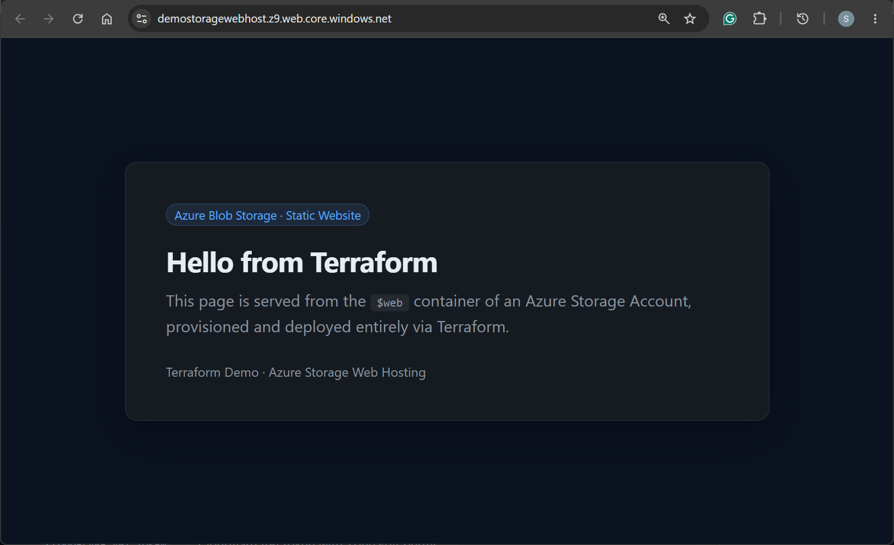
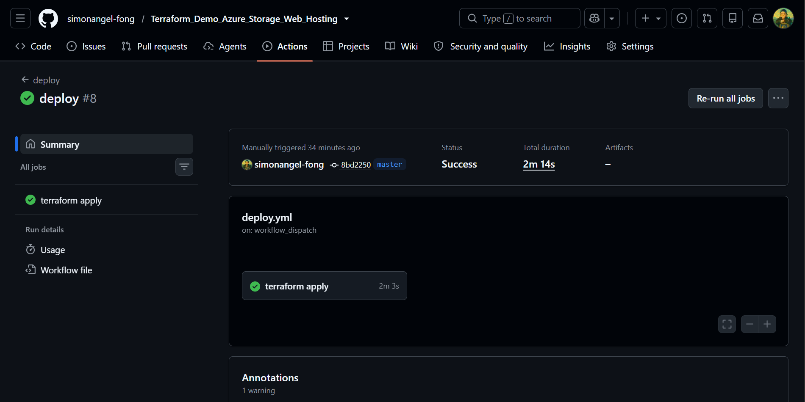

# Static Website Hosting on Azure Storage with Terraform

> An `Infrastructure-as-Code` project that provisions an `Azure Storage Account` and publishes a static website using `Terraform`.

  

---

## Prerequisites

Create the resource group that will hold the application's Azure resources:

```sh
APP_NAME="demo-storage-web-host"
APP_RG_NAME="demo-storage-web-host-dev"
LOCATION="canadacentral"

az group create -n "$APP_RG_NAME" -l "$LOCATION" \
  --tags project="$APP_NAME" tier=platform managed_by=platform
```

---

## Provision Resources with `Terraform`

```sh
# Initialize the remote backend
terraform -chdir=infra init -backend-config=backend.hcl

# Format and validate
terraform -chdir=infra fmt -recursive
terraform -chdir=infra validate

# Plan and apply
terraform -chdir=infra plan
terraform -chdir=infra apply
```

### How it works

1. Creates an Azure Storage Account inside the application resource group.
2. Enables the static website feature on the account.
3. Uploads `index.html` and `404.html` to the `$web` container.

### Result

The site is publicly accessible at the storage account's primary web endpoint.



---

## Automated Deployment with `GitHub Actions`

The repository uses `OIDC` federation to authenticate `GitHub Actions` against `Azure` — no client secrets are stored.

### Setup

1. Register an application in `Microsoft Entra ID`.
2. Add a **federated identity credential** scoped to this repository and branch.
3. Assign the required `RBAC roles` on the application resource group and the `Terraform` state container.
4. Add `AZURE_CLIENT_ID`, `AZURE_TENANT_ID`, and `AZURE_SUBSCRIPTION_ID` as repository secrets.

### Authentication flow

```txt
[ GitHub Actions Runner ]
          │
          │  (1. Workflow declares: id-token: write)
          │
          ├──(2. Request OIDC JWT)─────────────────> [ GitHub OIDC Provider ]
          │
          │ <──(3. Returns signed OIDC JWT)──────────┘
          │
          ├──(4. Exchange JWT for an Azure token:
          │       OIDC JWT + Client ID + Tenant ID)
          │────────────────────────────────────────> [ Microsoft Entra ID ]
          │                                         (Validates issuer, audience,
          │                                          subject claim, client ID,
          │                                          and federated credential)
          │
          │ <──(5. Returns short-lived access token)─┘
          │
          └──(6. Call Azure Resource Manager APIs)
                 using the access token, scoped to
                 the target subscription and RBAC
          ────────────────────────────────────────> [ Azure Resources ]
```


